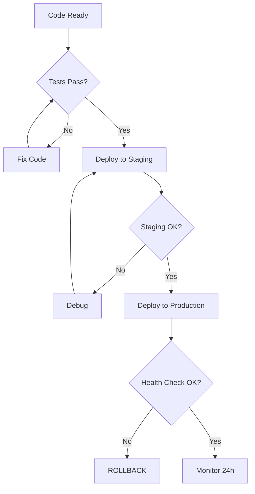

# Deployment Skill - SmartKet ERP

## 🎯 Propósito

Esta skill define el **proceso completo de deployment** desde desarrollo hasta producción, asegurando alta disponibilidad y rollback rápido si hay problemas.

## 🚀 Estrategia de Deployment

### Ambientes

```
Development (Local)
    ↓
Staging (Pruebas pre-producción)
    ↓
Production (Usuarios reales)
```

**Regla**: Nunca deployar directamente a producción sin pasar por staging.

---

## 📋 Pre-Deploy Checklist

### Code Quality
- [ ] Tests pasan (PHPUnit, Vitest)
- [ ] Linter sin errores
- [ ] No logs de debug (`dd()`, `console.log`)
- [ ] Namespaces validados
- [ ] Composer dependencies actualizadas

### Database
- [ ] Migraciones probadas en staging
- [ ] Seeders de producción preparados
- [ ] Backup de DB actual realizado

### Configuration
- [ ] Variables `.env` verificadas
- [ ] Secrets rotados si es necesario
- [ ] Cache limpiada

### Documentation
- [ ] CHANGELOG actualizado
- [ ] README con nuevas features (si aplica)
- [ ] API docs actualizadas

---

## 🛠️ Scripts de Deployment

### 1. Pre-Deploy Checklist Script
```powershell
.\. agent\skills\deployment\scripts\pre-deploy-checklist.ps1
```

**Output**: ✅/❌ para cada item del checklist

### 2. Deploy a Staging
```bash
.\. agent\skills\deployment\scripts\deploy-staging.sh
```

**Qué hace**:
1. Pull latest code
2. Install dependencies
3. Run migrations
4. Build assets
5. Restart services

### 3. Deploy a Production
```bash
.\. agent\skills\deployment\scripts\deploy-production.sh
```

**Qué hace**: Similar a staging, pero con validaciones adicionales

### 4. Rollback
```bash
.\. agent\skills\deployment\scripts\rollback.sh --to=v1.2.3
```

**Qué hace**: Revierte a versión anterior en caso de fallo

---

## 📦 Deployment Steps (Production)

### Fase 1: Preparación (Local → Git)
```bash
# 1. Ejecutar tests
npm run test

# 2. Build production
cd smartket-app && npm run build
cd smartket-landing && npm run build

# 3. Commit y tag
git add .
git commit -m "Release v1.3.0"
git tag v1.3.0
git push origin main --tags
```

### Fase 2: Deploy Backend (API)
```bash
# SSH al servidor
ssh user@smartket-api.com

# Pull código
cd /var/www/smartket-api
git pull origin main

# Modo mantenimiento ON
php artisan down

# Dependencias
composer install --no-dev --optimize-autoloader

# Migraciones (landlord)
php artisan migrate --database=landlord --force

# Migrar todos los tenants
php artisan tenants:migrate --force

# Cache
php artisan config:cache
php artisan route:cache
php artisan view:cache

# Modo mantenimiento OFF
php artisan up

# Restart workers
php artisan queue:restart
```

### Fase 3: Deploy Frontend (App + Landing)
```bash
# En servidor frontend
cd /var/www/smartket-app
git pull origin main
npm install
npm run build

# Lo mismo para landing
cd /var/www/smartket-landing
git pull origin main
npm install
npm run build
```

### Fase 4: Health Checks
```bash
# Verificar que todo esté up
curl https://api.smartket.com/api/health
curl https://app.smartket.com/
curl https://smartket.com/
```

---

## 🔄 Zero-Downtime Deployment

Para deployments sin interrupciones:

### Opción 1: Blue-Green Deployment
1. Deploy a servidor "green" (inactivo)
2. Probar en green
3. Switch traffic de "blue" a "green"
4. Mantener blue como backup 24h

### Opción 2: Rolling Deployment
1. Deploy a servidor 1 de N
2. Probar
3. Deploy a servidor 2 de N
4. Repetir

---

## 🐋 Docker Deployment (Recomendado)

Ver: `.agent/skills/deployment/examples/docker-compose.yml`

```yaml
version: '3.8'
services:
  api:
    image: smartket/api:latest
    environment:
      - APP_ENV=production
  app:
    image: smartket/app:latest
  db:
    image: postgres:15
```

**Comando**:
```bash
docker-compose up -d --scale api=3  # 3 instancias para HA
```

---

## ⚙️ Server Configuration

### Nginx
Ver: `.agent/skills/deployment/examples/nginx.conf`

```nginx
server {
    listen 80;
    server_name api.smartket.com;
    
    location / {
        proxy_pass http://localhost:8000;
        proxy_set_header Host $host;
    }
}
```

### Supervisor (Workers)
Ver: `.agent/skills/deployment/examples/supervisor.conf`

```ini
[program:smartket-worker]
command=php /var/www/smartket-api/artisan queue:work
autostart=true
autorestart=true
```

---

## 🔐 Security Checklist

- [ ] SSL/TLS habilitado (HTTPS)
- [ ] Firewall configurado (solo puertos necesarios)
- [ ] `.env` con permisos 600
- [ ] Secrets en vault (no en código)
- [ ] Rate limiting activado
- [ ] CORS configurado correctamente

---

## 📊 Monitoring Post-Deploy

### Primeras 24h
- [ ] Verificar logs cada 2h
- [ ] Monitorear performance (response times)
- [ ] Revisar error rates
- [ ] Confirmar que no hay issues multi-tenant

### Primeros 7 días
- [ ] Analizar usage patterns
- [ ] Identificar bottlenecks
- [ ] Feedback de usuarios

---

## 🚨 Rollback Strategy

### Cuándo hacer rollback:
- Error rate > 5%
- Performance degradado > 50%
- Bug crítico descubierto
- Data corruption

### Cómo:
```bash
# 1. Identificar versión estable anterior
git log --oneline | head -10

# 2. Ejecutar rollback script
./deploy/rollback.sh --to=v1.2.3

# 3. Verificar
curl https://api.smartket.com/api/health
```

---

## 📖 Deployment Flowchart

Ver: `.agent/skills/deployment/resources/deployment-flowchart.mmd`



---

## 🎓 Cuándo Usar Esta Skill

✅ **Usar para**:
- Deployments a staging/production
- Configurar CI/CD
- Setup de servidores nuevos
- Disaster recovery

❌ **No para**:
- Desarrollo local
- Hot-fixes menores (usar workflow simplificado)

---

## 💡 Best Practices

1. **Deploy en horario de bajo tráfico** (madrugada)
2. **Comunicar a usuarios** con antelación
3. **Tener plan de rollback** siempre listo
4. **Automatizar lo máximo posible**
5. **Documentar cada deploy** (qué, cuándo, quién)
